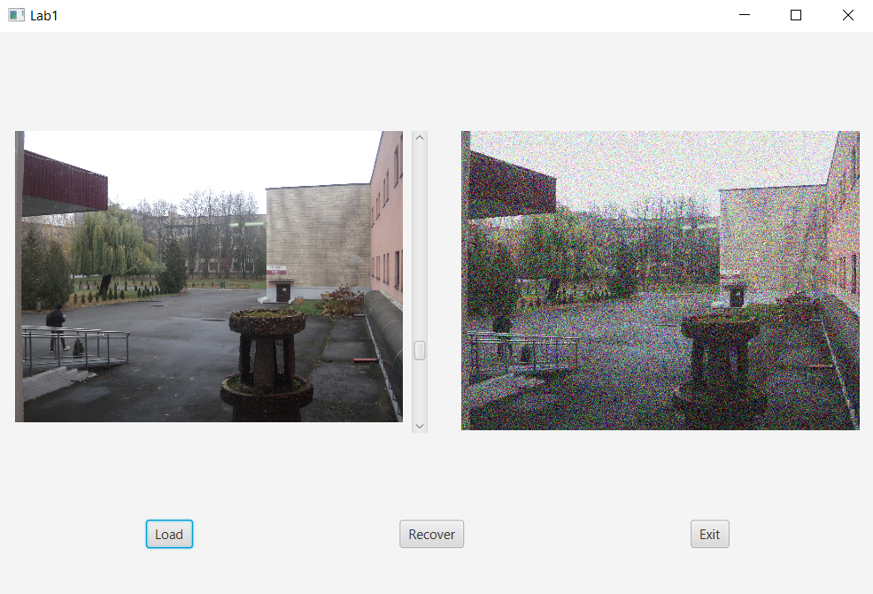

# Лабораторная работа №1
 По дисциплине «Графический интерфейс интеллектуальных систем»

## Тема «Фильтрация изображения от импульсных помех

Выполнил
Студент 3 курса, группы ИИ-23  
Волкогон Н.И.

Проверила
Ситковец Я.С.

2 вариант

## Цель работы

Фильтрация изображения от импульсных помех.

## Задание

Составить программу, выполняющую фильтрацию изображения от импульсных помех.

Необходимые характеристики
изображение хранится во внешнем файле;
программно в изображение вносятся помехи (точки, линии, ...);
программа должна выводить исходное и отфильтрованное изображения, должна присутствовать возможность выбора уровня зашумления, порога фильтра, размера окна.
Варианты (тип фильтра)
медианный фильтр. окно 1хN И Nx1. т.е. должен осуществляться проход изображения по строкам и столбцам (отдельно и вместе).

1. Исходное изображение и выбранный шум

2. Отфильтрованное изображение

