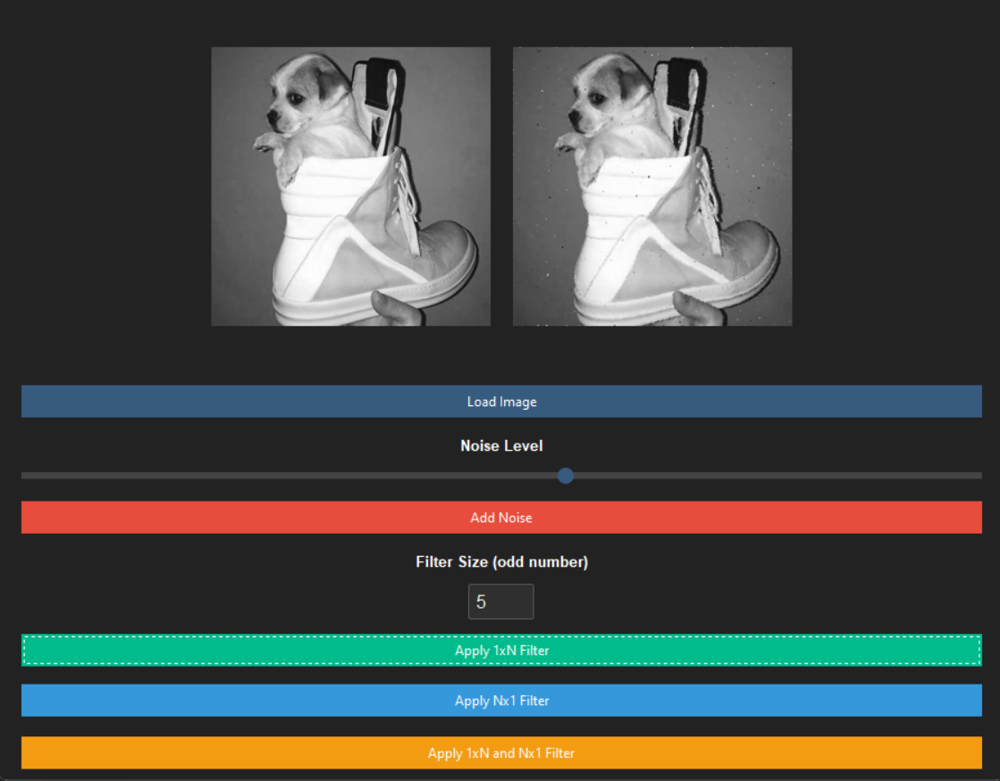
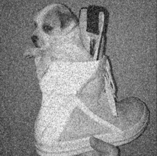
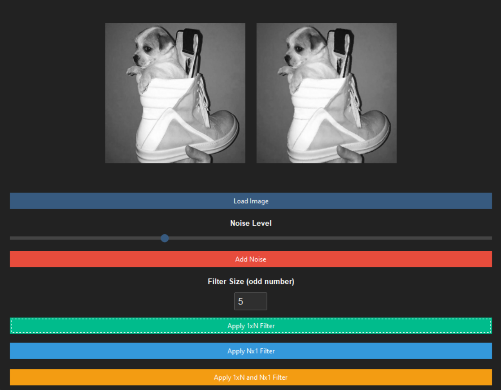
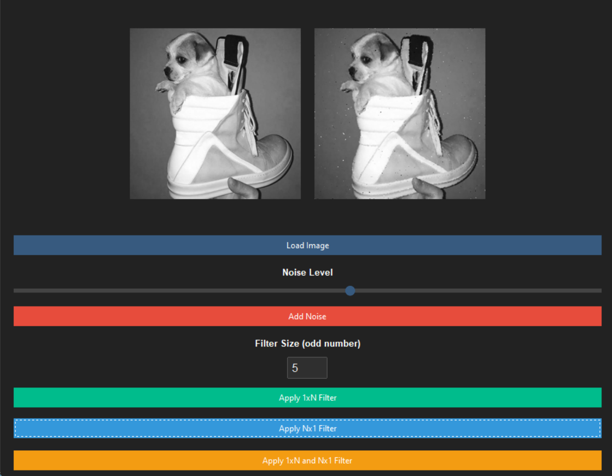
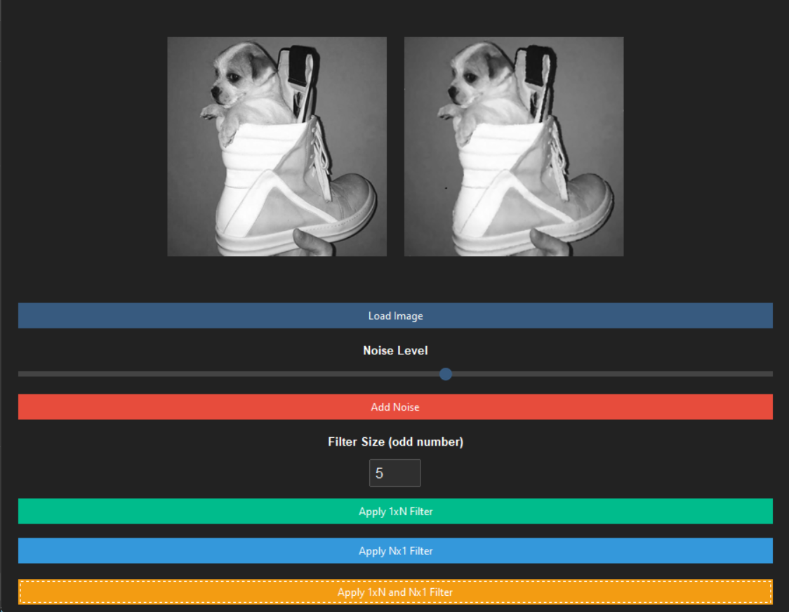

# Лабораторная работа №1
 По дисциплине «Графический интерфейс интеллектуальных систем»

## Тема: «Фильтрация изображения от импульсных помех

**Выполнил:**
Студент 3 курса, группы ИИ-23  
Медведь П.В.

**Проверила:**
Ситковец Я.С.

5 вариант

## Цель работы

Фильтрация изображения от импульсных помех.

## Задание

Составить программу, выполняющую фильтрацию изображения от импульсных помех.

Необходимые характеристики:
изображение хранится во внешнем файле;
программно в изображение вносятся помехи (точки, линии, ...);
программа должна выводить исходное и отфильтрованное изображения, должна присутствовать возможность выбора уровня зашумления, порога фильтра, размера окна.
Варианты (тип фильтра)
медианный фильтр. крестообразное окно различного(!) размера, возможность изменения центра.

1. Исходное изображение

2. Зашумленное изображение

3. Отфильтрованное изображение

4. Дополнительны фильтры

